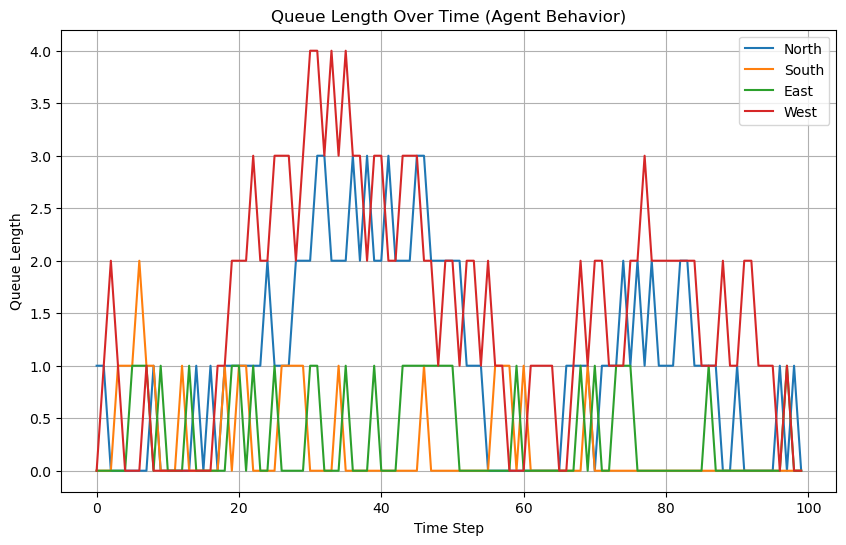

# greenwave-ai
Adaptive AI signals for smooth, congestion‑reducing traffic waves.

# 🚦 Traffic Signal Optimizer (Prototype)

A lightweight reinforcement learning prototype to optimize 4-lane traffic junctions, inspired by FUSION (TFL) and built under computing constraints (Google Colab). Merges rule-based logic and policy gradient methods to simulate intelligent signal control.

---

## 🎯 Objectives

- Simulate traffic flow at a 4-way junction (N, S, E, W)
- Optimize wait time, reduce congestion
- Use RL agent to learn adaptive signal switching

---

## 🔧 Tech Stack

- Python, NumPy
- Matplotlib
- Gymnasium
- Stable-Baselines3 (PPO Agent)
- Google Colab

---

## 🧠 Sutskever-like Intuition

> _"In environments where sensory flow is continuous but structure is hidden, intelligence emerges when the system learns not just to act—but to listen to the delay between cause and resolution."_  

This RL agent doesn’t just act on queues—it learns from the waiting. Like a neuron delaying a spike, it modulates response.

---

## 🗂️ Folder Structure

| Folder       | Description |
|--------------|-------------|
| `environment/` | Traffic logic and gym environment |
| `notebooks/`   | Training + simulation notebooks |
| `models/`      | Saved RL models |
| `utils/`       | Helper utilities |
| `/`      | Visuals and conceptual images |

---

## 🧠 Interpreting Your PPO Agent's Behavior (Sutskever-style)
This plot is a direct manifestation of what the PPO agent has learned through interacting with the simulated traffic environment.

### In simple terms:

* Each line (North, South, East, West) shows how long the traffic queue is at each time step.

* A low line means cars are moving efficiently in that direction.

* A high line means congestion is building up.

## 📊 Sample Output

✅ To-Do
 - [x] Build simulator

 - [x] Create Gym interface

 - [x] Train PPO agent

 - [x] Visualize queues

 - [ ] Add realism via SUMO (optional)

 - [ ] Deploy interactive demo (optional)

## 🤝 Credits
Based on FUSION research (Yunex Traffic, Transport for London (TfL))
[FUSION Traffic Optimization (Yunex)](https://www.yunextraffic.com/wp-content/uploads/2024/04/Yunex-Traffic_Fusion_Paper_EN.pdf)

Prototype designed by Fahad Ali
